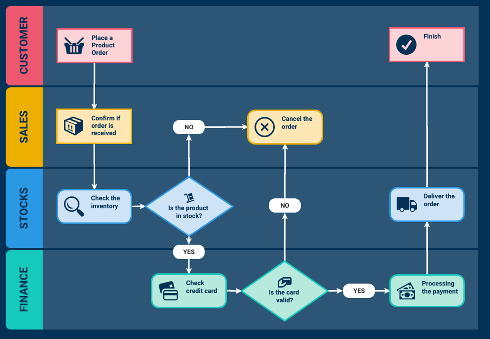

# 🏢 Development Portal - Test Content Repository
This page contains sample content for testing our domain-specific chatbot parsing capabilities
## Product Ordering System Documentation
### Product Ordering System Overview
Our product ordering system is designed to provide a seamless experience from purchase to delivery. Customers can browse through our catalog, add items to their cart, and place orders using a secure checkout process.
### Inventory Management
Real-time inventory tracking ensures that product availability is always up-to-date. When a customer places an order, the system immediately checks inventory status to confirm whether the item is in stock. This reduces the chances of order delays or cancellations due to stockouts.
### Payment Verification and Processing
Our platform supports multiple payment methods including credit cards, debit cards, and digital wallets. Every transaction undergoes a validation check to ensure the payment method is legitimate and authorized. Invalid or declined cards automatically trigger a failed transaction response, notifying the customer to use an alternate payment method.
### Order Validation and Fulfillment
Once an order is placed and payment is confirmed, the fulfillment process begins. The system generates a unique order ID, updates stock levels, and forwards the request to the logistics team for dispatch. Customers receive a confirmation email and tracking information for their shipment.
### Delivery and Tracking
Orders are shipped via trusted courier services, with real-time tracking available through the user dashboard. Delivery times vary based on location, but our logistics algorithm optimizes routing to ensure timely arrival. Notifications are sent at key milestones, such as dispatch, out for delivery, and successful handover.
### Order Cancellation Policy
Orders may be canceled automatically if:
- The product is no longer in stock at the time of processing
- The payment could not be verified
- The customer requests a cancellation before dispatch

All canceled orders are logged, and customers are refunded promptly through the original payment method.
## API Documentation - Product Ordering System
Below is the complete API specification for the Product Ordering System. This includes all endpoints for managing orders, products, and user authentication.
## Order Processing Workflow - Swimlane Diagram
[Swimlane diagram would be placed here showing the order processing workflow across Customer, System, Payment Gateway, and Fulfillment departments]
